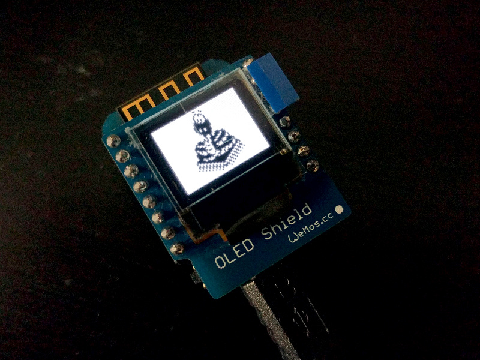

# MicroPython

## Install

Give user access to /dev/ttyUSB0:

`sudo usermod -a -G dialout $USER`

### ESP32

`pip3 install esptool`

`python3 -m esptool --port /dev/ttyUSB0 erase_flash`

`python3 -m esptool --chip esp32 --port /dev/ttyUSB0 write_flash -z 0x1000 ~/Downloads/esp32-20180511-v1.9.4.bin`

`screen /dev/ttyUSB0 115200`

`pip3 install mpfshell`

`python3 -m mp.mpfshell`

### ESP8266

`python3 -m esptool --port /dev/ttyUSB0 erase_flash`

`python3 -m esptool --port /dev/ttyUSB0 --baud 115200 write_flash 0 esp8266-20180511-v1.9.4.bin`

## Wemos D1 Mini

### OLED Shield

https://forum.micropython.org/viewtopic.php?t=1637#p11474

https://wiki.wemos.cc/products:retired:oled_shield_v1.1.0

https://github.com/wendlers/mpfshell

https://github.com/adafruit/micropython-adafruit-ssd1306/blob/master/ssd1306.py

https://docs.micropython.org/en/latest/esp8266/library/machine.I2C.html

`mpfshell -s main.mpf`

(Then restart the MCU.)

https://micropython-on-wemos-d1-mini.readthedocs.io/en/latest/shields.html#oled

