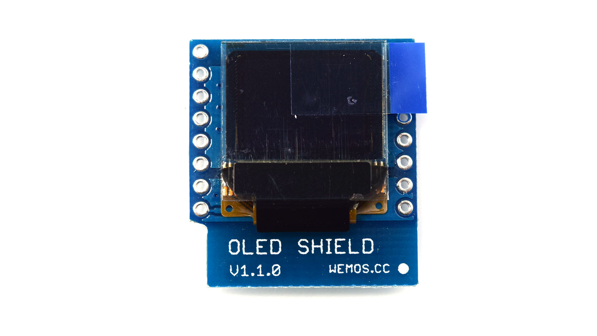

# MicroPython

## Wemos D1 Mini

### OLED Shield

https://wiki.wemos.cc/products:retired:oled_shield_v1.1.0

https://github.com/wendlers/mpfshell

https://github.com/adafruit/micropython-adafruit-ssd1306/blob/master/ssd1306.py

https://docs.micropython.org/en/latest/esp8266/library/machine.I2C.html

`mpfshell -s main.mpf`

(Then restart the MCU.)

